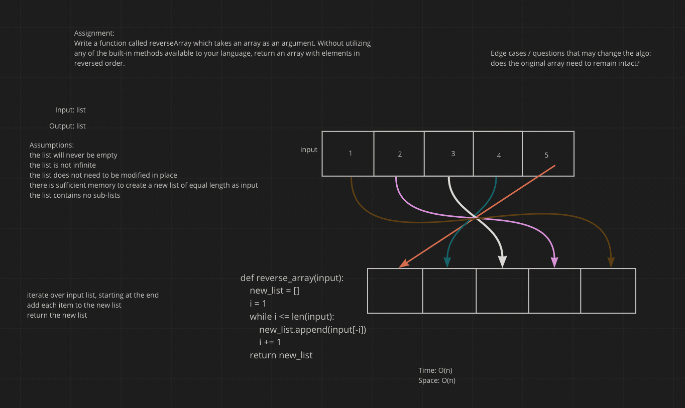

# Reverse an Array
<!-- Description of the challenge -->
Write a function called reverseArray which takes an array as an argument. Without utilizing any of the built-in methods available to your language, return an array with elements in reversed order.

## Whiteboard Process
<!-- Embedded whiteboard image -->

## Approach & Efficiency
<!-- What approach did you take? Discuss Why. What is the Big O space/time for this approach? -->
time: O(n)
space: O(n)

I iterated over the array, it would be impossible to do this without touching each item at least once, so I just went with the first O(n) solution that came to mind.
