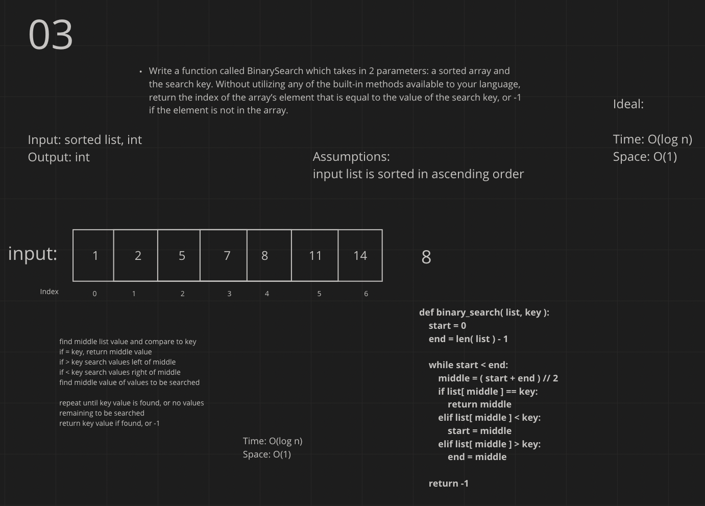

# Insert to Middle of an Array
<!-- Description of the challenge -->
Write a function called BinarySearch which takes in 2 parameters: a sorted array and the search key. Without utilizing any of the built-in methods available to your language, return the index of the array’s element that is equal to the value of the search key, or -1 if the element is not in the array.

## Whiteboard Process
<!-- Embedded whiteboard image -->

## Approach & Efficiency
<!-- What approach did you take? Discuss Why. What is the Big O space/time for this approach? -->
time: O(log n)
space: O(1)

I tried this with recursion and pretty quickly realized its not easy to track the index in relation to the original list, works well for finding the value but not the index. So I did some reading in Introduction to Algorithms third edition and realized you can just keep track of your search boundaries without calling a new function.
