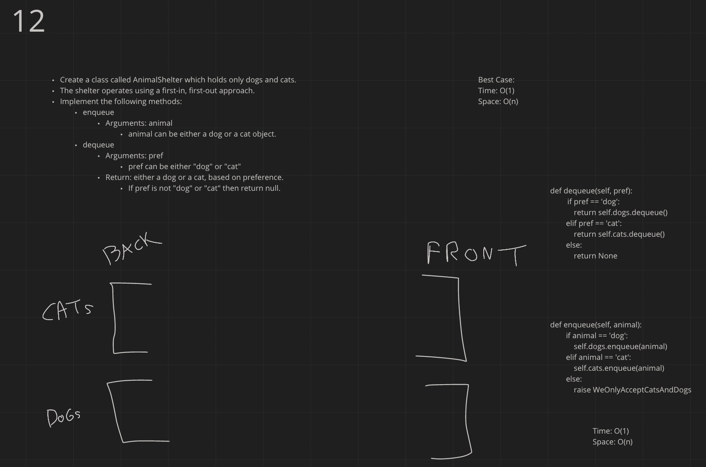

# Challenge Summary
<!-- Description of the challenge -->
Code Challenge
First-in, First out Animal Shelter.

## Whiteboard Process
<!-- Embedded whiteboard image -->

## Approach & Efficiency
<!-- What approach did you take? Why? What is the Big O space/time for this approach? -->
I used a cat and dog queue in the animalshelter class, and then used the queues enqueue and dequeue methods
Time: O(1)
Space O(n)

## Solution
<!-- Show how to run your code, and examples of it in action -->

PR: https://github.com/heckerdavid/data-structures-and-algorithms/pull/26
