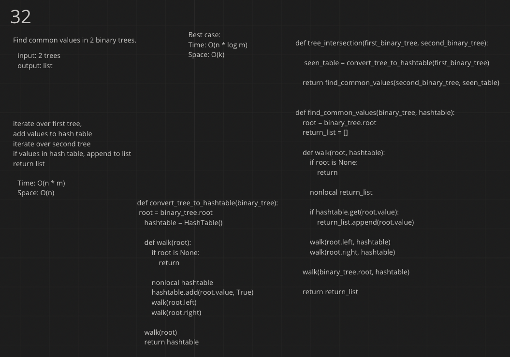

# Challenge Summary
<!-- Description of the challenge -->

* Write a function called tree_intersection that takes two binary trees as parameters.

* Using your Hashmap implementation as a part of your algorithm, return a set of values found in both trees.

## Whiteboard Process
<!-- Embedded whiteboard image -->

## Approach & Efficiency
<!-- What approach did you take? Why? What is the Big O space/time for this approach? -->
I chose to convert all values from the first tree into a hashtable, and then traverse the second tree, comparing values to the hash table. I chose this because it is relatively simple and the instructions said I had to use a hashtable
Time: O(n * m)
Space: O(k)
## Solution
<!-- Show how to run your code, and examples of it in action -->
