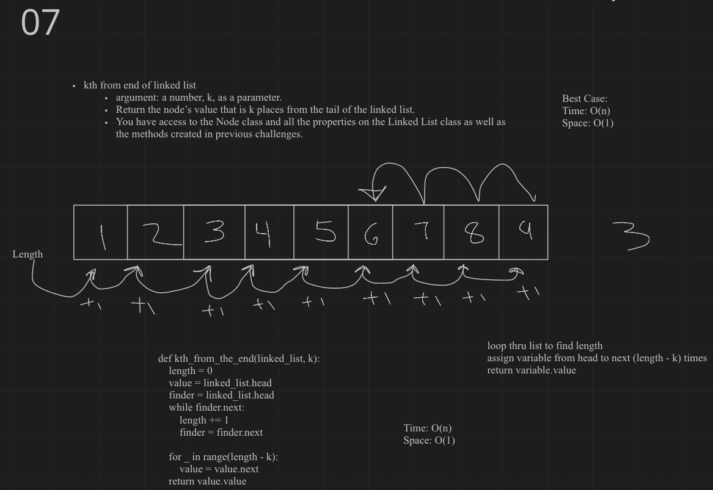

# Singly Linked List
<!-- Short summary or background information -->
Code Challenge 05
Code Challenge 06
Code Challenge 07
## Challenge
<!-- Description of the challenge -->
* Code Challenge 05

Node
    Create a Node class that has properties for the value stored in the Node, and a pointer to the next Node.

Linked List
    Create a Linked List class

Within your Linked List class, include a head property.
Upon instantiation, an empty Linked List should be created.
The class should contain the following methods:

insert
    Arguments: value
    Returns: nothing
    Adds a new node with that value to the head of the list with an O(1) Time performance.

includes
    Arguments: value
    Returns: Boolean
    Indicates whether that value exists as a Node’s value somewhere within the list.

to string
    Arguments: none
    Returns: a string representing all the values in the Linked List, formatted as:
        "{ a } -> { b } -> { c } -> NULL"

* Code Challenge 06
Write the following methods for the Linked List class:

append
    arguments: new value
    adds a new node with the given value to the end of the list
insert before
    arguments: value, new value
    adds a new node with the given new value immediately before the first node that has the value specified
insert after
    arguments: value, new value
    adds a new node with the given new value immediately after the first node that has the value specified

* Code Challenge 07
Write the following method for the Linked List class:

kth from end
    argument: a number, k, as a parameter.
    Return the node’s value that is k places from the tail of the linked list.
    You have access to the Node class and all the properties on the Linked List class as well as the methods created in previous challenges.

PR: https://github.com/heckerdavid/data-structures-and-algorithms/pull/21
## Approach & Efficiency
<!-- What approach did you take? Why? What is the Big O space/time for this approach? -->
Challenge 07:
Iterated over the list to find length then iterated again to find desired item,
time O(n)
space O(1)
## API
<!-- Description of each method publicly available to your Linked List -->
