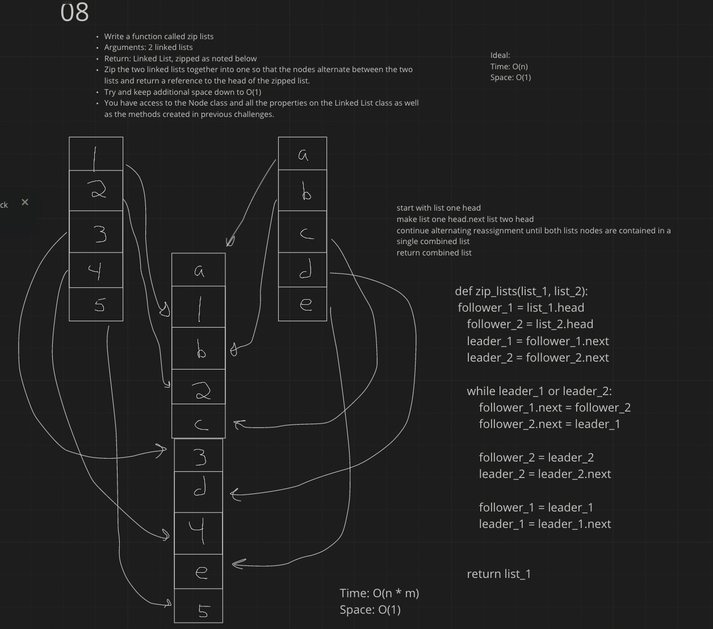

# Singly Linked List
<!-- Short summary or background information -->
Code Challenge 08

## Challenge
<!-- Description of the challenge -->
Write a function called zip lists
Arguments: 2 linked lists
Return: Linked List, zipped as noted below
Zip the two linked lists together into one so that the nodes alternate between the two lists and return a reference to the head of the zipped list.
Try and keep additional space down to O(1)
You have access to the Node class and all the properties on the Linked List class as well as the methods created in previous challenges.

PR:

## Approach & Efficiency
<!-- What approach did you take? Why? What is the Big O space/time for this approach? -->
Challenge 08:

time: O(n * m)
space: O(1)

## API
<!-- Description of each method publicly available to your Linked List -->
