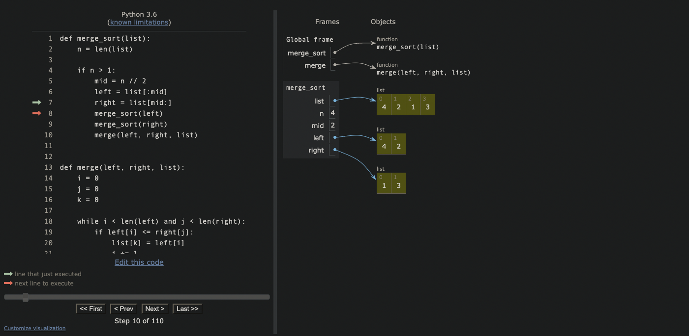
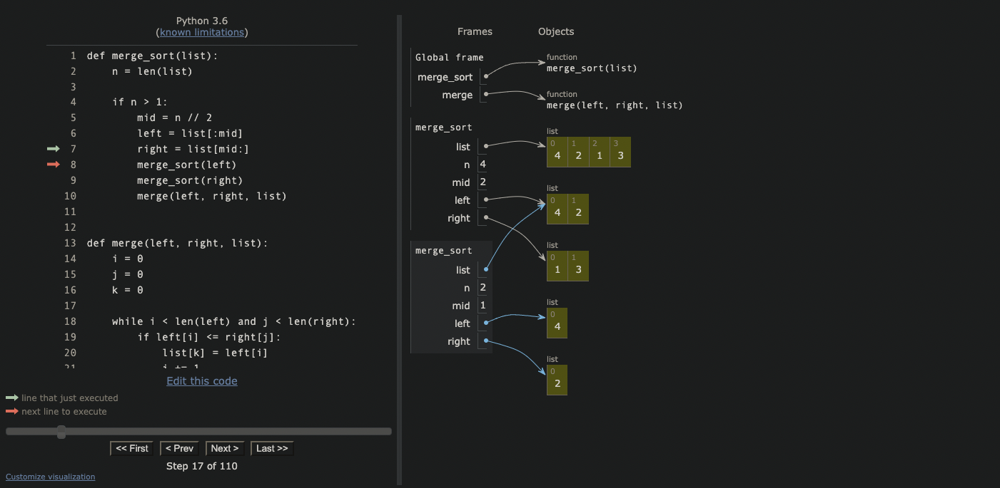
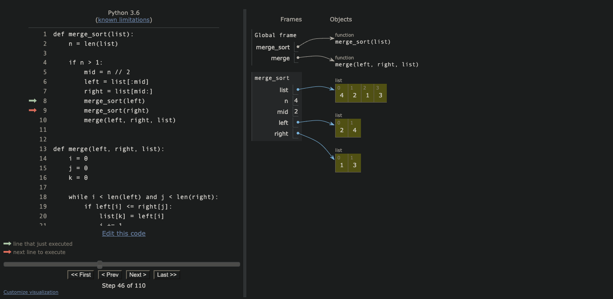
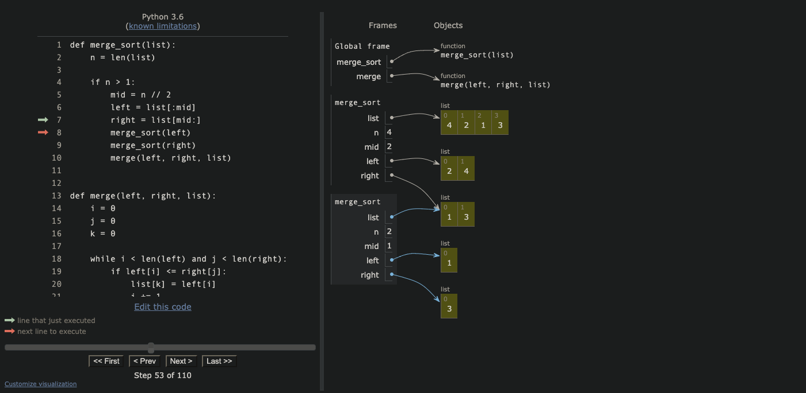
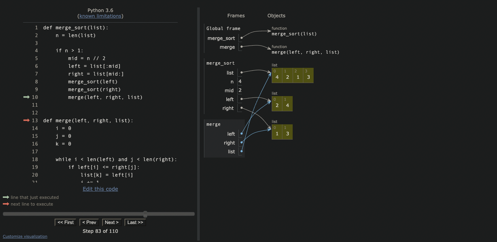
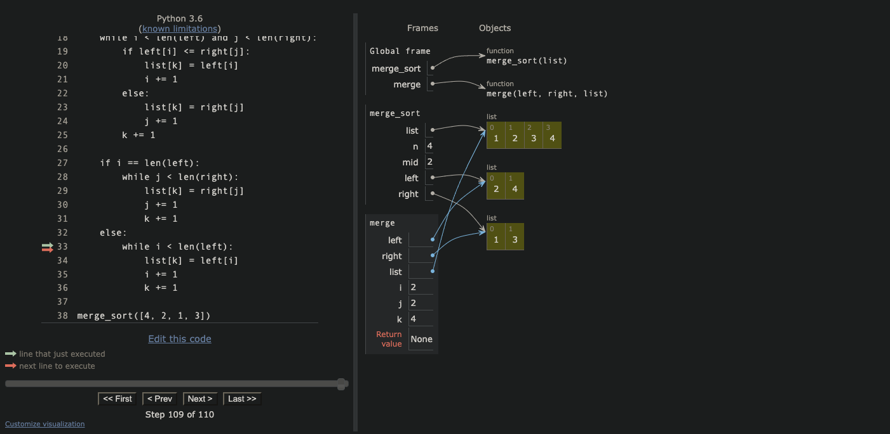

# Merge Sort

* We call merge sort on our un-ordered list, it splits the list in the middle and recursively sorts both halves

* recursion is repeated until base case (length is less than or equal to 1) is met

* merge is then used to zipper these sorted sub-lists together, maintaining order

* and then repeated for the other half of the original sub-list

* Once both sub lists are ordered they are zippered together by merge

* and the final list is sorted

