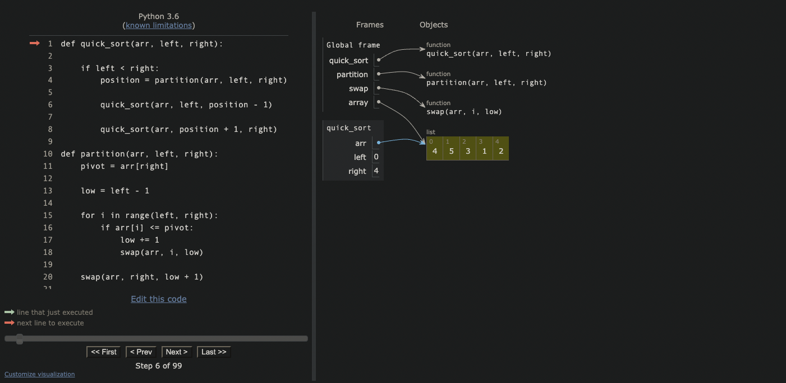
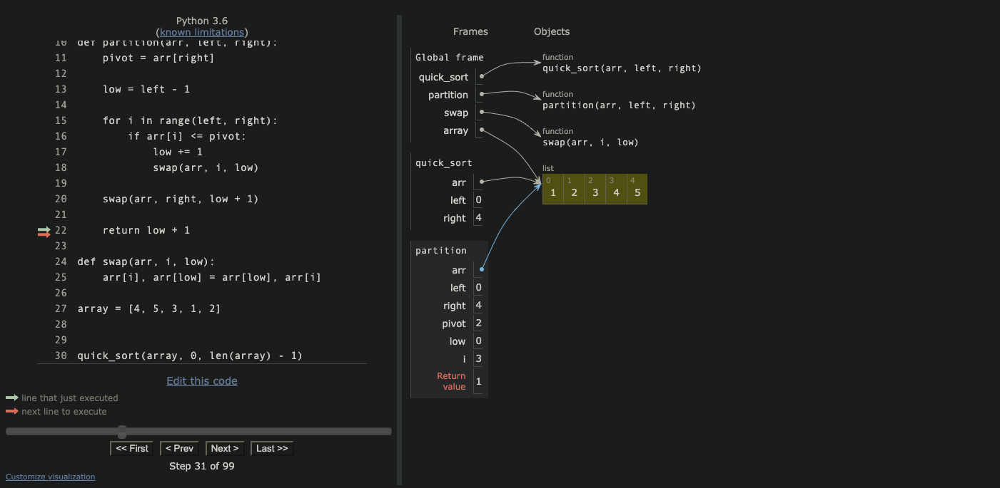
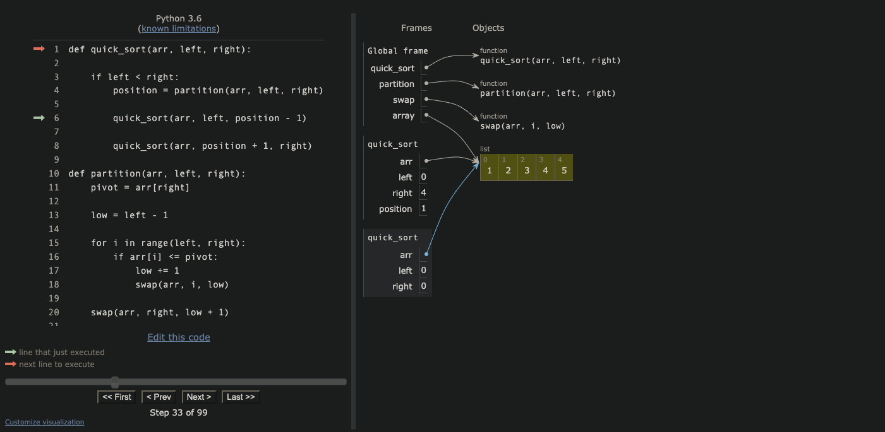

# Quick Sort

* Quick sort is a recursive sorting algorithm
* It works by selecting a pivot from the unsorted array and then placing all values lower than the pivot to its left, and all values higher than the pivot to its right
* once all values have been re-arranged around the pivot, both sides of the pivot are recursively quick sorted

* first we call the function, passing in the unsorted list, as well as the left and right most index numbers
  * note: The base case for this recursive call is the left index being greater than the right index

* Next we choose a pivot and begin to swap values, this is done with the use of helper functions

* Now that all of the values are on the correct side of the chosen pivot, we can recursively quick sort both sides of the pivot individually, following the same process

