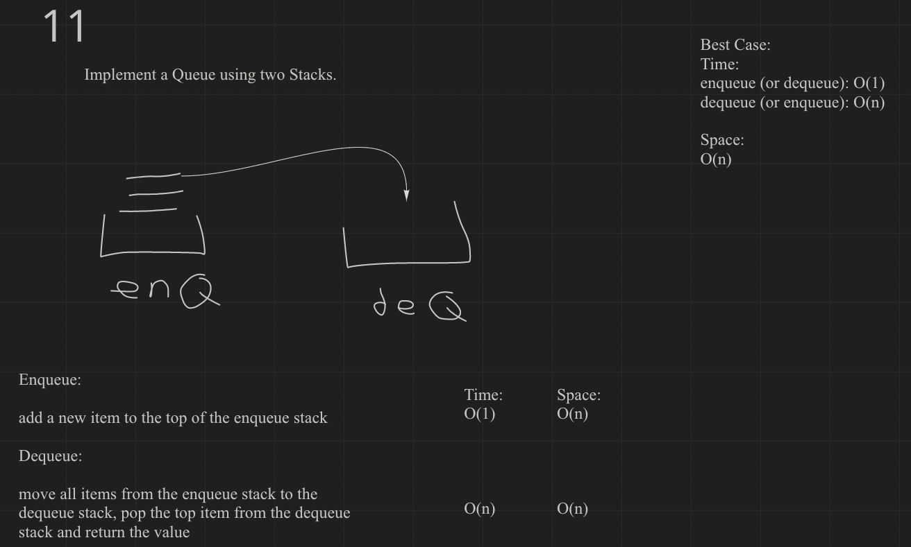

# Challenge Summary
<!-- Description of the challenge -->
Implement a Queue using two Stacks.

## Whiteboard Process
<!-- Embedded whiteboard image -->

## Approach & Efficiency
<!-- What approach did you take? Why? What is the Big O space/time for this approach? -->
I wrote this so that it would take O(1) time to enqueue to the stack, assuming that would happen more often. This leaves dequeuing to O(n) time.

## Solution
<!-- Show how to run your code, and examples of it in action -->
